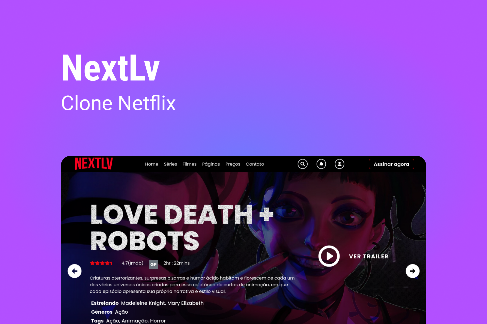

# NextLv | Clone Netflix

> Clone of netflix interface with vite, react and tailwindcss. Using a JavaScript object file to simulate an API that would provide the video data. 
> Using some libraries to provide the side scrolling slide or to make the navigation of a Single Page Application, for example.
